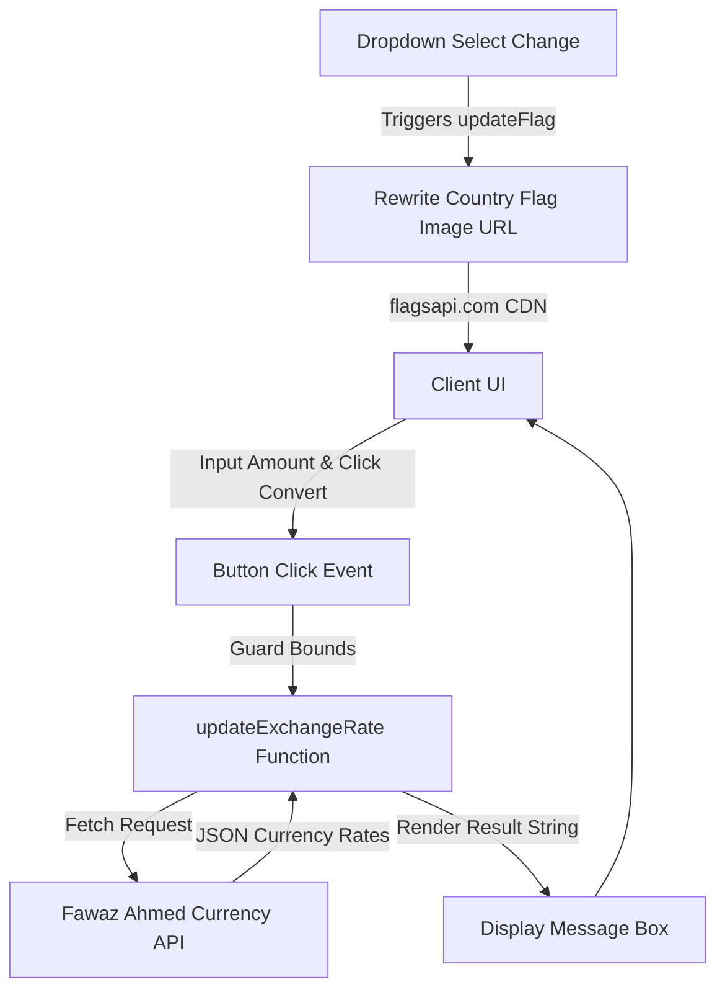

# Web Development Revision Hub

A comprehensive and professional resource tracking web development concepts, responsive designs, vanilla styling systems, flexbox algorithms, and custom API-connected client applications developed by **Imtiaz Ali**.

This repository serves as a sandbox for mastering intermediate and advanced front-end capabilities, focusing on structured layouts, loaders, responsive grid templates, and dynamic web interfaces.

---

## 🛠️ Technology Stack & Languages


---

## 🚀 Key Modules & Project Portfolios

### 1. 💱 Dynamic Currency Converter ([js/](file:///d:/for%20CV/My%20learnings/web-development-revision/js))
An interactive, single-page currency conversion dashboard utilizing the modern ES6 `async/await` fetch API:
*   **Real-time Exchange Telemetry**: Fetches up-to-date exchange values from the Fawaz Ahmed CDN (`@fawazahmed0/currency-api`).
*   **Country Flag Binding**: Integrates `flagsapi.com` dynamically. When a user updates currency dropdown selectors, event listeners rewrite image source flags dynamically (`https://flagsapi.com/COUNTRY_CODE/flat/64.png`).
*   **Safe Input Calculations**: Auto-guards input bounds; fields defaulting below 1 or empty states are reset automatically to 1 before calculation.
*   **File References**:
    *   [index.html](file:///d:/for%20CV/My%20learnings/web-development-revision/js/index.html): Custom responsive select-option container.
    *   [first.js](file:///d:/for%20CV/My%20learnings/web-development-revision/js/first.js): The core API connection, flag-updating engine, and calculations processor.
    *   [codes.js](file:///d:/for%20CV/My%20learnings/web-development-revision/js/codes.js): Master dictionary mapping currency IDs to country codes (e.g. `USD: "US"`, `PKR: "PK"`).

### 2. 📦 Amazon Clone Project ([Css_Project/](file:///d:/for%20CV/My%20learnings/web-development-revision/Css_Project))
A comprehensive interface replication of the Amazon homepage:
*   **Grid Layouts**: Complex grid modules managing user categories, banners, shop boxes, and hero highlights.
*   **Navigation Mechanics**: Consolidates search bars, sign-in submenus, regional togglers, and shopping carts.
*   **Responsive Styling System**: Implements hover cards, CSS box-sizing models, and flexible media queries inside [style.css](file:///d:/for%20CV/My%20learnings/web-development-revision/Css_Project/style.css) and [index.html](file:///d:/for%20CV/My%20learnings/web-development-revision/Css_Project/index.html).

### 3. 📐 Advanced CSS Styling Suite ([css/](file:///d:/for%20CV/My%20learnings/web-development-revision/css))
A collection of progressive UI stylesheets covering advanced layout engines:
*   **Level 1 to 5 Concepts**: Focuses on absolute and relative layout positions, background sizing, overflow setups, custom transform metrics, and custom shadows.
*   **Custom Animation Loaders**: [loader.html](file:///d:/for%20CV/My%20learnings/web-development-revision/css/loader.html) and [loader.css](file:///d:/for%20CV/My%20learnings/web-development-revision/css/loader.css) configure an elegant CSS-only keyframe spinner.

### 4. 🔲 CSS Flexbox & Design Services ([css-flexbox/](file:///d:/for%20CV/My%20learnings/web-development-revision/css-flexbox))
Focuses on design systems using CSS Flexbox:
*   **Basic Properties**: Practices alignment attributes (`justify-content`, `align-items`, `flex-wrap`, and `flex-grow`).
*   **Flexbox Project Portfolio**: Inside [flexbox-project/](file:///d:/for%20CV/My%20learnings/web-development-revision/css-flexbox/flexbox-project), a professional landing page showcasing Web Designing, Web Development, and App Development service cards in a responsive grid.

### 5. 📑 Personal Resume Portfolio ([html/](file:///d:/for%20CV/My%20learnings/web-development-revision/html))
A clean, semantic HTML website representing a personal CV structure:
*   **Core Pages**: [index.html](file:///d:/for%20CV/My%20learnings/web-development-revision/html/index.html) (Landing), [aboutme.html](file:///d:/for%20CV/My%20learnings/web-development-revision/html/aboutme.html), [education.html](file:///d:/for%20CV/My%20learnings/web-development-revision/html/education.html), [experiance.html](file:///d:/for%20CV/My%20learnings/web-development-revision/html/experiance.html), and [projects.html](file:///d:/for%20CV/My%20learnings/web-development-revision/html/projects.html).
*   **Semantic Tags**: Structured with semantic HTML5 elements (`<header>`, `<main>`, `<section>`, and `<article>`).

---

## 📐 Currency Converter Application Flow

The client-side API architecture operates via asynchronous event bindings:



---

## 📂 Repository File Directory

```
web-development-revision/
├── Css_Project/           # Amazon home page layout clone
│   ├── index.html         # Main Amazon clone page structure
│   ├── style.css          # Styling rules for clone grid
│   └── hero-image.jpg     # Carousel hero element
├── css/                   # Level-based CSS exercises
│   ├── loader.html        # Custom CSS spinner showcase
│   ├── loader.css         # Keyframe animation styles
│   ├── index-level5.html  # Complex positioning and absolute alignment exercises
│   └── style-level5.css   # Advanced styling properties
├── css-flexbox/           # Flexbox training and layouts
│   ├── flexbox-project/   # Responsive services page showcase
│   │   ├── index.html     # Web services presentation cards
│   │   └── style.css      # Flex rules aligning cards
│   ├── index.html         # Basic flex training elements
│   └── style.css          # Basic flex alignment configurations
├── html/                  # Semantic HTML personal profile pages
│   ├── index.html         # Portfolio main landing page
│   ├── aboutme.html       # Profile personal overview page
│   ├── education.html     # Academic history timeline
│   └── experiance.html    # Work history layout
└── js/                    # JavaScript ES6 interactive components
    ├── index.html         # Converter layout container
    ├── first.js           # Fetch API logic and flag updates
    ├── codes.js           # Master dictionary mapping codes
    └── style.css          # Visual layout rules for converter
```

---

## 🚀 Setup & Usage Guide

### Run HTML/CSS Modules
Because this is a static sandbox repository, compile tools are not required. You can launch pages using standard browser tools:
1.  **Clone the Repository**:
    ```bash
    git clone https://github.com/your-username/web-development-revision.git
    cd web-development-revision
    ```
2.  **Open in Local Browser**:
    To review projects (e.g. Amazon clone or Currency Converter), open files directly:
    *   **Currency Converter**: `js/index.html`
    *   **Amazon Clone**: `Css_Project/index.html`
    *   **Portfolio Website**: `html/index.html`
    *   **Services Flexbox Grid**: `css-flexbox/flexbox-project/index.html`
    *   **CSS Keyframe Loader**: `css/loader.html`

*Note: The Currency Converter requires an active internet connection to download country flags from `flagsapi.com` and rate datasets from Fawaz Ahmed's CDN.*
